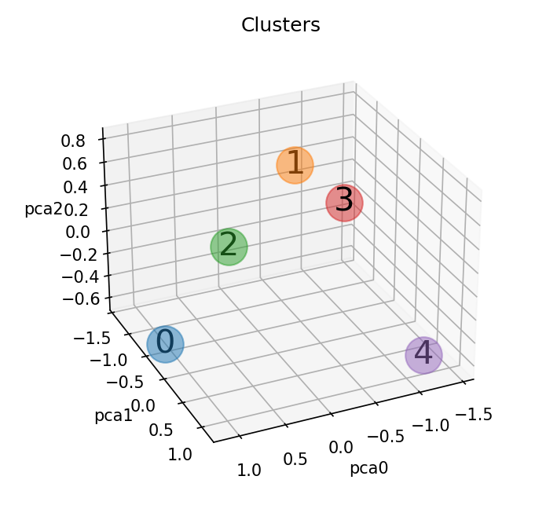
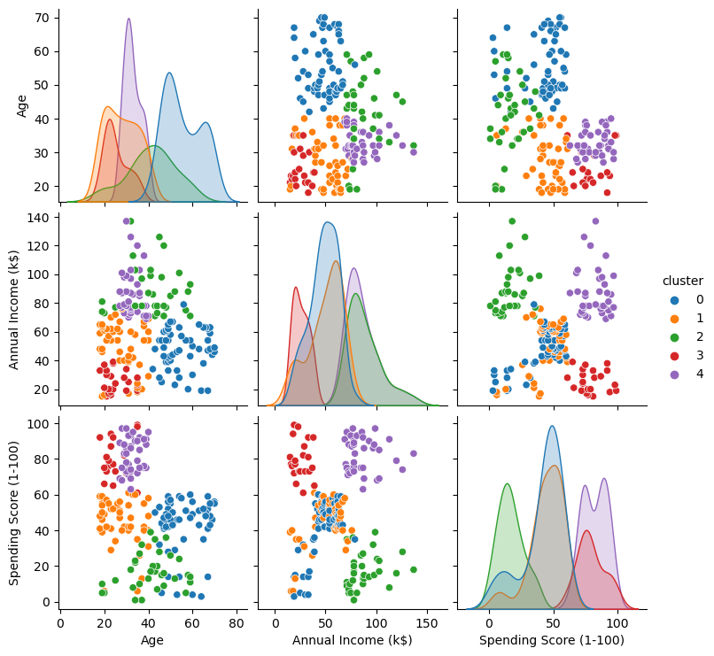
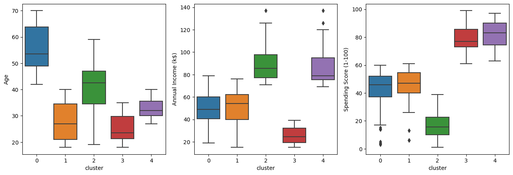

[](https://github.com/victorHZDias)
[](https://www.python.org/)

# Segmentação de clientes de um supermercado

Um supermercado, através de cartões de fidelidade, possui alguns dados básicos sobre seus clientes, como idade, gênero, renda anual e pontuação de gastos. Tal pontuação é algo que o supermercado atribui ao cliente com base em parâmetros definidos, como comportamento do cliente e dados de compra. O supermercado deseja entender melhor seus clientes, de modo a formular estratégias de negócios, e para isso contratou um cientista de dados para realizar uma segmentação dos clientes.



[Link original para o dataset](https://www.kaggle.com/vjchoudhary7/customer-segmentation-tutorial-in-python)

Projeto de clusterização para um Supermercado usando sklearn,pandas.

<p align="center"> 
  <a href="https://github.com/victorHZDias" target="_blank"></a> 
</p>

## Objetivos

O objetivo deste projeto, é de segmentar os clientes de um supermercado com base em seus dados de compra. Em um cenário real, tal segmentação poderia ser utilizada pelo supermercado para entender melhor os clientes e formular estratégias de negócios de acordo com a classificação do cliente.

## Estrutura do repositório

O repositório está estruturado da seguinte forma:

```
├── dados
├── imagens
├── modelos
├── notebooks
├── reports
```

- Na pasta `dados` estão os dados utilizados no projeto. O arquivo `Mall_Customers.csv` é o dataset utilizado originalmente. Os demais arquivos são os datasets gerados durante o projeto.
- Na pasta `imagens` estão as imagens utilizadas neste README.
- Na pasta `modelos` estão os modelos gerados durante o projeto.
- Na pasta `notebooks` estão os notebooks com o desenvolvimento do projeto. Em detalhes, temos:
  - [`projeto_supermercado_01_eda.ipynb`](notebooks/projeto_supermercado_01_eda.ipynb): notebook com a análise exploratória dos dados usando [ydata-profiling](https://github.com/ydataai/ydata-profiling) e Seaborn.
  - [`projeto_supermercado_04_pipeline.ipynb`](notebooks/projeto_supermercado_04_pipeline.ipynb): notebook com a clusterização dos dados usando K-Means utilizando pipelines do Scikit-Learn.
  - [`projeto_supermercado_05_pipeline_pca.ipynb`](notebooks/projeto_supermercado_05_pipeline_pca.ipynb): notebook com a clusterização dos dados usando K-Means após redução de dimensionalidade com PCA utilizando pipelines do Scikit-Learn.
  - [`funcoes_auxiliares.py`](notebooks/funcoes_auxiliares.py): arquivo com funções auxiliares utilizadas nos notebooks.
- Na pasta `reports` estão os relatórios gerados durante o projeto utilizando a biblioteca [ydata-profiling](https://github.com/ydataai/ydata-profiling).

## Detalhes do dataset utilizado e resumo dos resultados

O dataset utilizado é o contido no arquivo [`Mall_Customers.csv`](dados/Mall_Customers.csv), que contém os seguintes dados:

- `CustomerID`: ID do cliente
- `Gender`: sexo do cliente
- `Age`: idade do cliente
- `Annual Income (k$)`: renda anual do cliente
- `Spending Score (1-100)`: pontuação de gastos do cliente

Com o pipeline realizando pré-processamento, PCA e K-Means, a base foi segmentada em 5 clusters, como mostrado nas figuras abaixo:





- Cluster 0 - pontuação de gastos moderada, renda moderada, idade alta
- Cluster 1 - pontuação de gastos moderada, renda moderada, idade jovem
- Cluster 2 - pontuação de gastos baixa, renda alta, idade moderada
- Cluster 3 - pontuação de gastos alta, renda baixa, idade jovem
- Cluster 4 - pontuação de gastos alta, renda alta, idade jovem

Transformando os pontos acima em uma tabela:

| Pontuação de Gastos | Renda    | Idade    | Cluster |
| ------------------- | -------- | -------- | ------- |
| Moderada            | Moderada | Alta     | 0       |
| Moderada            | Moderada | Jovem    | 1       |
| Baixa               | Alta     | Moderada | 2       |
| Alta                | Baixa    | Jovem    | 3       |
| Alta                | Alta     | Jovem    | 4       |

## Como reproduzir o projeto

O projeto foi desenvolvido utilizando o Python 3.11.4. Para reproduzir o projeto, crie um ambiente virtual com o Conda, ou ferramenta similar, com o Python 3.11.4 e instale as bibliotecas abaixo:

| Biblioteca   | Versão |
| ------------ | ------ |
| Matplotlib   | 3.7.1  |
| NumPy        | 1.24.3 |
| Pandas       | 1.5.3  |
| Scikit-Learn | 1.3.0  |
| Seaborn      | 0.12.2 |

Essas são as bibliotecas principais utilizadas no projeto. O relatório foi gerado com a biblioteca [ydata-profiling](https://github.com/ydataai/ydata-profiling), instale-a se quiser reproduzir o relatório. Para ter um gráfico em 3 dimensões interativo, instale a biblioteca [ipympl](https://matplotlib.org/ipympl/).
